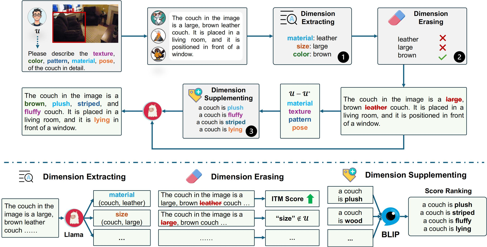

# Detailed Object Description with Controllable Dimensions

<!--p align="center">
    <a href="https://llava.hliu.cc/"></a> <br>
    Generated by <a href="https://gligen.github.io/">GLIGEN</a> via "a cute lava llama with glasses" and box prompt
</p-->

Code for our paper ["Detailed Object Description with Controllable Dimensions"](https://arxiv.org/abs/2411.19106).

<p align="center">
     <br>
  <p align="center" style="font-size:1.2vw;">The diagram of our description refinement pipeline, Dimension Tailor</p>
</p>

## Contents
- [Install](#install)
- [Weights](#weights)
- [Inference](#inference)

## Install

1. Clone this repository and navigate to Attribute Polisher folder
```bash
git clone https://anonymous.4open.science/r/145501C3/
cd ObjectDescription
```

2. Install Package
```Shell
conda create -n tailor python=3.10 -y
conda activate tailor
pip install --upgrade pip  # enable PEP 660 support
pip install -r requirements.txt
```

## Weights

We used BLIP-itm and Llama 3 to score and process the descriptions.

Please download the weights of BLIP-itm from https://huggingface.co/Salesforce/blip-itm-large-coco/tree/main.

For Llama 3, please follow the guidance of [this](https://github.com/meta-llama/llama3) to download the weights of Meta-Llama-3-8B-Instruct.

## Inference

You can use any image and its corresponding caption to refine with our model.
Here, we used images from COCO2017 dataset for experiments. LLaVA generation caption were performed in advance, and the results were saved in a JSON file.

1. Download the COCO2017 val dataset

You can use [this](http://images.cocodataset.org/zips/val2017.zip) to download the COCO2017 val dataset.

2. Detailed Object Descriptions Inference

```Shell
CUDA_VISIBLE_DEVICES=$gpu python description_refiner.py \
    --llama_model_dir $HUGGINGFACE_DIR/Meta-Llama-3-8B-Instruct \
    --blip_model_dir $HUGGINGFACE_DIR/blip-itm-large-coco \
    --image_root $DATASET_DIR/COCO/val2017 \
    --f_description LLaVA/llava_detailed_answer.json \
    --f_result results/llava_refined_detailed_answer.json \
    --f_ovad_anno ovad/ovad2000.json \
    --complete True \
    --complete_threshold 0.3 \
    --l_threshold 0.1 \
    --seed 33 \
    --f_obj_dim_attr_comb pred_obj_dim_attr_comb.json
```

3.  Controllable Object Descriptions Inference

```Shell
CUDA_VISIBLE_DEVICES=$gpu python description_refiner.py \
    --llama_model_dir $HUGGINGFACE_DIR/Meta-Llama-3-8B-Instruct \
    --blip_model_dir $HUGGINGFACE_DIR/blip-itm-large-coco \
    --image_root $DATASET_DIR/COCO/val2017 \
    --f_description LLaVA/llava_ctrl_detailed_answer.json \
    --f_result results/llava_refined_ctrl_detailed_answer.json \
    --f_ovad_anno ovad/ovad2000.json \
    --refine_control True \
    --complete True \
    --complete_threshold 0.3 \
    --l_threshold 0.2 \
    --seed 33 \
    --f_obj_dim_attr_comb pred_obj_dim_attr_comb.json
```

## Acknowledgement

- [OVAD](https://github.com/OVAD-Benchmark/ovad-benchmark-code): Some of our code borrows from OVAD, and you can find more information [here](https://ovad-benchmark.github.io/).

## Related models
Here's the model we tested in our paper:

- [LLaVA](https://github.com/haotian-liu/LLaVA)
- [GPT4ROI](https://github.com/jshilong/GPT4RoI)
- [AlphaCLIP](https://github.com/SunzeY/AlphaCLIP)
- [Ferret](https://github.com/apple/ml-ferret)
- [Osprey](https://github.com/CircleRadon/Osprey)

## Citation
If this work is helpful to you please consider citing the article below.
```text
@misc{wang2024detailedobjectdescriptioncontrollable,
      title={Detailed Object Description with Controllable Dimensions}, 
      author={Xinran Wang and Haiwen Zhang and Baoteng Li and Kongming Liang and Hao Sun and Zhongjiang He and Zhanyu Ma and Jun Guo},
      year={2024},
      eprint={2411.19106},
      archivePrefix={arXiv},
      primaryClass={cs.CV},
      url={https://arxiv.org/abs/2411.19106}, 
}
```


